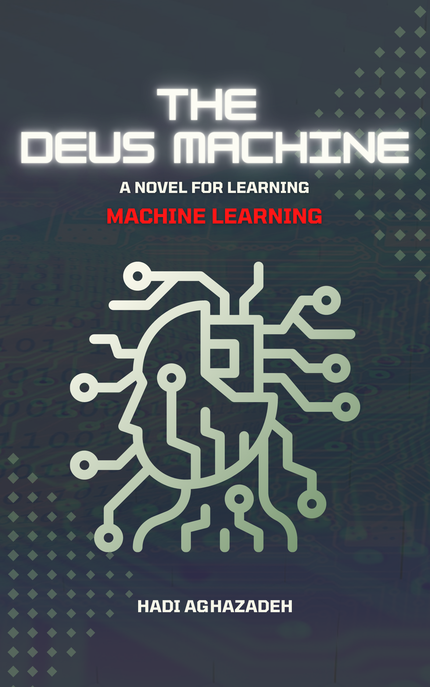

# The_Deus_Machine
The Deus Machine, A novel for Learning Machine Learning

What happens if a machine becomes the God?

Spinoza, my favorite philosopher said that God is nature indeed and Hegel, the philosopher of philosophers said that God is the history. The history in which the constant battle or dialectic between a thesis and an antithesis creates a synthesis. In the sequence of these battles and in the conflict of interests of them, self-consciousness is raised, and this collective self-consciousness is God.
 
For me, however, history may not be my God, but it is an endless source of stories. Stories of victories, defeats, cruelties, killing and being killed, seeking justice and never finding it, and finally, despite all the pains and sufferings, finding new routes toward the future or even creating it.

Stories have an eccentric power. People have always gathered around those who have been great narratives. These leaders have been able to translate the pains and sufferings, laughter and joys of those people and turning them into meaningful stories that narrate their way of thinking and feelings and gives them a new identity or re-imagine their forgotten identity.

And I, who from a young age was full of the inner flames of opposing forces. I, who had mathematics and logic along with fiery emotions in novels and stories together, and I was looking for an avenue of escape to unite these far apart paths and interests, found the only way to relieve myself in writing stories.

Yes, stories are the closest way to make a bridge between logic and emotion, and this is how good stories changed the course of history.

And now, the story of this book…

Among the many quotes from Steve Jobs that are told and being heard among the people, there is an implicit quote, happened to not heeded, and that he believed the fundamental innovations in the future would occur at the intersection of the experimental sciences with the humanities.

Mathematics, stories, philosophy, and music are the things I love most in this world. I'm glad Steve Jobs and his quotes were part of helping, which guided me to think about putting all my interests into one story and reconciling them. This is the story of this story.

I think the best purpose for my life is to stand at the intersection of the experimental sciences with the humanities and thereby expand the boundaries of human cognition and find new uncharted territories on how we understand the world and ourselves too. This story is the beginning of my adventures in the purpose of my life.

I know there are many who know Artificial Intelligence algorithms better than me and are very smart and hardworking in this field. Still, in the two years that I have been involved in designing and writing this story, I have tried a new and innovative way to give Machine Learning algorithms a new perspective. In this way, while teaching machine learning algorithms from basic to advanced concepts such as Deep Learning in a simple way, I combine the whole process with a story.

I am sure that the two's symmetry will both reinforce the pleasure of learning and will be an incentive, for my part, to the old desire to build an intelligence that is equal to human intelligence.

Artificial intelligence and machine learning have advanced dramatically over the years. The day is not far when these algorithms will dominate many aspects of our lives. The desire of many people who work in this area is to create a new brain, like their own, and in this way challenge themselves and, in a larger sense, expand the boundaries of human cognition.

In this story, I have put together all the machine learning, philosophy, and what I know about writing stories, to create a new antagonist, which is not a machine that looks like a man but a machine that intends to become the God of them to compete with them.

Machine learning is the core of this story. The Deus Machine and those three anonymous reformers whose destiny accompanied them together are equipped with machine learning. They use machine learning to fight with machine learning.

Who will be the winner of this battle or dialectic?